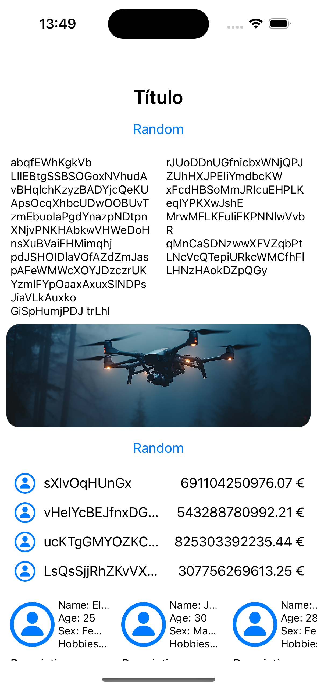
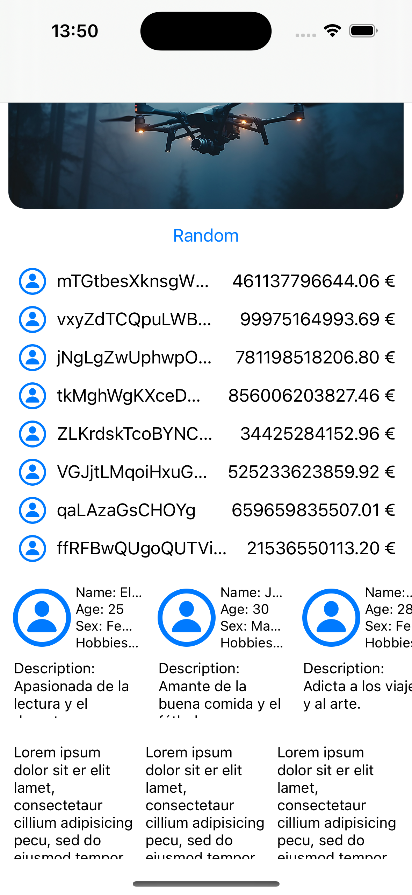
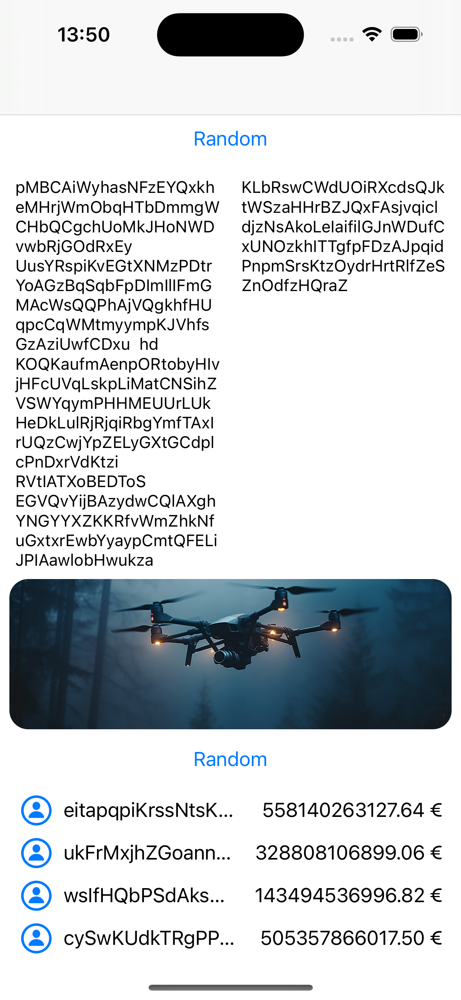

# RandomViewer

RandomViewer es una aplicación que muestra información aleatoria sobre usuarios y elementos, diseñada para propósitos de aprendizaje y práctica en el desarrollo de aplicaciones móviles iOS.

## Descripción

La aplicación RandomViewer está diseñada para mostrar información aleatoria de usuarios y elementos en una interfaz de usuario intuitiva y fácil de usar. Utiliza datos simulados generados aleatoriamente para ofrecer una experiencia variada y dinámica a los usuarios.

## Características

- Visualización de información aleatoria de usuarios, incluyendo nombre, edad, sexo, hobbies y descripción.
- Generación de texto aleatorio para párrafos de texto.
- Visualización de elementos aleatorios en una caja con iconos y texto.
- Interfaz de usuario limpia y atractiva.

## Tecnologías utilizadas

- Lenguaje de programación: Swift
- Frameworks: UIKit
- Patrón de diseño: MVVM

## Capturas de pantalla

## Instalación

Para ejecutar la aplicación en un dispositivo iOS, sigue estos pasos:

1. Clona este repositorio en tu máquina local.
2. Abre el proyecto en Xcode.
3. Selecciona tu dispositivo de destino y haz clic en el botón de ejecución.

## Contribuciones

Las contribuciones son bienvenidas. Si quieres contribuir al desarrollo de RandomViewer, por favor abre un *issue* para discutir los cambios que te gustaría realizar o envía una *pull request* con tus mejoras propuestas.

## Licencia

RandomViewer está disponible bajo la licencia MIT. Para más detalles, consulta el archivo [LICENSE](LICENSE).

## Contacto

Si tienes alguna pregunta o sugerencia sobre RandomViewer, no dudes en ponerte en contacto con el desarrollador:

Nombre: Daniel Cazorro Frias
Email: leinadhunter10@hotmail.com
